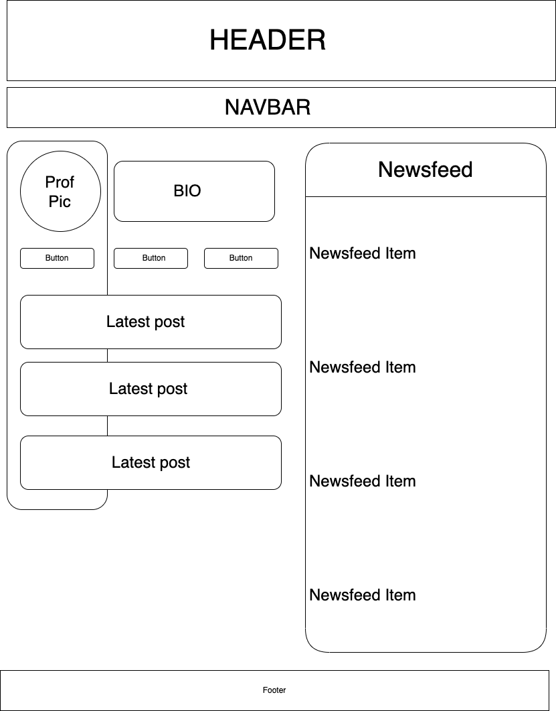

# Dragons Nest
### A social media website for dragons. 

### By Emma Gerigscott and Sarah Reimann

## Description

Using React, this website is a mockup of a dragon's social media homepage, showing posts by the user and a newsfeed of following users in the sidebar. This website is to practice React webpage layouts and currently has no dynamic functionality...for the time being.

## Component Diagram



## Technologies
* _React_
* _JSX_
* _webpack_
* _Javascript_

## Setup Instructions
1. Clone this repo to your desktop
2. Open your terminal (e.g Terminal or GitBash) and navigate to this project's directory, "dragons-nest".
3. Run ```npm install``` in the project's root directory to install necessary dependencies.
4. Run ```npm start``` in the project's root directory to start the app in a peanit 

## Known Bugs
* none, its perfect

